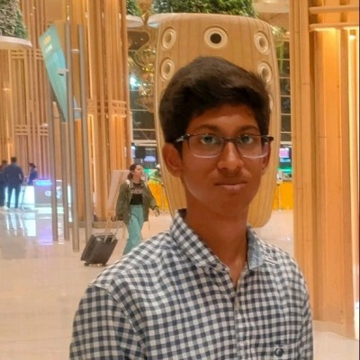

<p align="center">
  
</p>

<h1 align="center">
  
</h1>

<p align="center">
  
  
  
  
</p>

---

```
LLfLCffLCCffii1tfCCCLLLLLCLiLGLLLLCCCCLLfLLC    rajsekhar@vit
LLLLCfffCCff1ttfLCCLLLLLffLLLLLLLLLCGGLtiLLC    ---------------------------------------------
LffLCffLLLLCftfLLLLGLLf1iiii11tffLLCCCL1;LLC    OS: ................ BTech, CSE (AI & Data Engineering)
CffLLLffLLLCGffLLCCC1;;;;:::::;;;i1LLCC1iLLC    Host: ............... Vellore Institute of Technology (VIT)
LffLLLfLCLLG@GCLCCL;:,,,.  ..,::,,,:1CCiiLLC    Kernel: ............. 3rd Year / CGPA 8.54
LLLLLLffCLLLtfCfLf:,.              .:fC1iLLC    Uptime: .............. building toward Japan's tech industry
LCLLCLffCCCL11ttLi,.        .,...   .fC1;LCC
LLCLGCffGGGCf;;;f;.    .,,:;iiiii;, .1Ct;LCC    Languages.Programming: Python, SQL, C++, Java
LLLLGGffCGCLLi;;t1.   .:;;;;1tt1;;;..tCt;fCC    Languages.Human: ..... English, Hindi, 日本語 (JLPT in progress)
LLLLGGffCCCLL1t1fL,  .,;;:,::;;:,:;:,1Cf1LCC
LLLLGGLLLCCLGttLfL;:.,;i;;;;:;t:;iii;1CGGCCC    Hobbies.Learning: .... DSA, GCP data engineering, ML fundamentals
LLLLGGLLLCCLL;1Ltf;;::i1111i;1L11tttitCGCfCC    Hobbies.Building: .... hackathon projects, AI/ML club events
LLLLCGLLLGGf1LfLLLt;;;iiiii;;;1i11i11LCLfLCC
LLLLCGLLCGCL1tC0CfLftiiiiii;::::iii1LCG0CCCC    --- Contact ---
0CLLLGLLGC111i1LGCLLfti1iii;;iii;;ifCCCGGGCC    Email: ............... rajsekhar.singh5242523@gmail.com
0GLfL0LCGf;;,,;iLCLfffi;iiiii;;;;ifCCCCGGGCC    LinkedIn: ............ rajsekhar-singh-732932364
GCLfLLLLCt;;1titLCGCf;;;;;;;;;;iitLCCC0880CC    GitHub: ............... rajsekharsingh5242523
CGffLtfLLt11LLL0@8@GLt;;;;;;iiii1fLLC8@@@8CC
LCCCLLCLLG0CLC88880LLff1;;;ii11iiiL0@@@@@8CC    --- GitHub Stats ---
GCCG1i1i;L0LLG000GCftLfft;:;;ii;;:tG888@@8CC    Repos: ............... 9
00Gt;;;;t0GCGGGG0CLft1fLff1;;i;;;;fC0GG888GC    Stars: ................ 3
880L11it08000GCCCGLtLf11Lftt111ti1CCC0G00GGC    Focus: ................ Data Engineering -> Japan
8880000G0GGGGCCCCGLttf1i11;i1ft1ti1tfCGC0CCG
8888GCCCCLfLCCLLGLCLtLtfiti1t1t11ittffGCCLLG
888G1ttfLtttLLCGCGCLffLtftttft1itttffLCCLffL
08Cttt1tftt1ttLC0CGfLfLLLfftft1tfftfffLLLfff
0Gtttf1fft1ti11CLCffLLfCfCfLftfLfLffftfLLfff
8Ltttf1tftif1i1LtLtLffLLLCLCfffLLLLfftfffftf
8L1ttf1tf1i1tt;ffLfLfLLfCLCLfLtfffftfffffftf
```

<p align="center">
  
</p>

---

### 📡 Currently

```yaml
learning:      [DSA — arrays/hashing → trees → graphs → DP, GCP data services]
building:      Sales EDA pipeline — pandas dtype/chunksize, seaborn, rolling insights
targeting:     Google Professional Data Engineer certification (retake, winter)
chasing:       an internship pipeline into Japan's tech industry
club_role:     AI/ML club — reviews & event ops
```

---

### 🛠 Featured builds

| Project | What it does | Stack |
|---|---|---|
| **[Kubernetes-Auto-Healing-AI-Agent](https://github.com/rajsekharsingh5242523/rajsekharsingh5242523-Kubernetes-Auto-Healing-AI_Agent)** | AI-assisted SRE agent — detects OOMKilled/restart-loop incidents in a cluster, builds incident context, and produces policy-gated, human-readable root-cause reports (no silent auto-remediation) | Python, Kubernetes (kind), LLM reasoning |
| **[BhoomiSeva — DEBUGGERS_INNOHACK](https://github.com/Lakshya0023/DEBUGGERS_INNOHACK)** | Full-stack digital land-record & grievance-redressal platform — interactive map, ownership history, price trends, admin analytics | Flask, SQLite, Leaflet.js, Chart.js |
| **[DreamHack — DHARMACODE](https://github.com/zenithrastogi8899-glitch/DHARMACODE)** | AI-powered dream interpreter & visualizer, built at a hackathon using Gemini | HTML/JS, Gemini API |
| **[Fraud Detection Models](https://github.com/rajsekharsingh5242523/project)** | Exploratory fraud-detection modeling notebook | Python, Colab |
| **[GridSense (contributor)](https://github.com/yadavbibek-cloud/Mavericks)** | Cascading power-grid failure prediction — GNN risk modeling, Granger root-cause attribution, conformal uncertainty, what-if mitigation | PyTorch, FastAPI, Next.js |

---

### ⚙️ Toolbelt

<p align="center">
  
</p>

<p align="center">
  
  
  
  
  
  
</p>

---

### 📊 Stats

<p align="center">
  
  
</p>

<p align="center">
  
</p>

<p align="center">
  
</p>

---

### 🐍 Contribution graph

<p align="center">
  
</p>

---

### 🎯 Roadmap → 東京 (Tokyo)


---

<p align="center">
  
</p>

<p align="center">
  <em>"the present is the cheap part — the compound interest is in the reps you put in before anyone's watching."</em>
</p>
